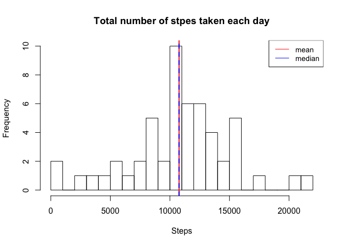
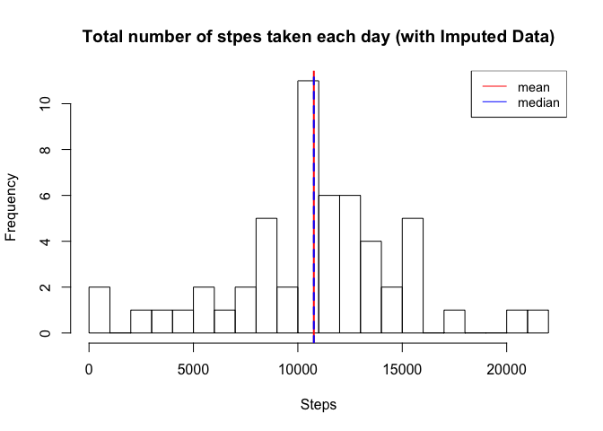
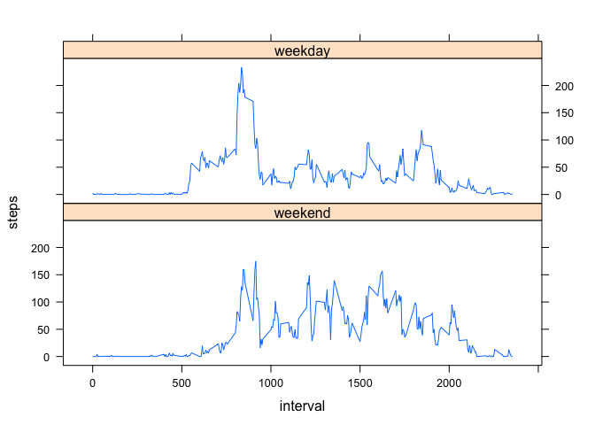

# Reproducible Research: Peer Assessment 1

## Loading and preprocessing the data

```r
# Read a csv file
activity <- read.csv(unz("activity.zip", "activity.csv"), header=TRUE ,sep=",")

# Transform the date column type from factor to Date
activity$date <- as.Date(activity$date, format="%Y-%m-%d") 
```

## What is mean total number of steps taken per day?
The mean and median total number of steps taken per day are almost identical (10766 and 10765, respectively), possibly indicating no outliers and nearly normal distribution of the total number of steps taken per day. 

```r
# Make a histogram of the total number of steps taken each day
total_steps_per_day <- with(subset(activity, !is.na(steps)), aggregate(steps ~ date, FUN=sum))
hist(total_steps_per_day$steps, main="Total number of stpes taken each day", xlab="Steps", ylab="Frequency", breaks=20)
legend("topright", c("mean","median"), lty=c(1,1), col=c("red","blue"), cex=0.9)

# Calculate and report the mean total number of steps taken per day
mean_total_steps_per_day <- mean(total_steps_per_day$steps)
mean_total_steps_per_day
```

```
## [1] 10766
```

```r
# Calculate and report the median total number of steps taken per day
median_total_steps_per_day <- median(total_steps_per_day$steps)
median_total_steps_per_day
```

```
## [1] 10765
```

```r
abline(v=mean_total_steps_per_day, lwd=2, col="red")
abline(v=median_total_steps_per_day, lwd=2, col="blue", lty="dashed")
```

 

```r
# Export the histogram as a png file
dev.copy(png, file="figures/PA1_plot1.png", width=480, height=480, bg="white")
```

```
## quartz_off_screen 
##                 3
```

```r
dev.off()
```

```
## pdf 
##   2
```

## What is the average daily activity pattern?
Overall, activity starts to increase right after the interval 500 (early  morning, around after 5am). Activity peaks at the interval at 835 (moring commute, around 8:35am), and ramins relatively high until around the interval 1900 (early evening, around 7pm) with some fluctuation. After then, activity decreases continuously.

```r
# Make a time series plot (i.e. type = "l") of the 5-minute interval (x-axis) and the average number of steps taken, averaged across all days (y-axis)
avg_steps_every_5min <- with(subset(activity, !is.na(steps)), aggregate(steps ~ interval, FUN=mean))
with(avg_steps_every_5min, plot(interval, steps, type="l"))
```

 

```r
# Export the time series plot as a png file
dev.copy(png, file="figures/PA1_plot2.png", width=480, height=480, bg="white")
```

```
## quartz_off_screen 
##                 3
```

```r
dev.off()
```

```
## pdf 
##   2
```

```r
# Which 5-minute interval, on average across all the days in the dataset, contains the maximum number of steps?
avg_steps_every_5min$interval[which(avg_steps_every_5min$steps == max(avg_steps_every_5min$steps))]
```

```
## [1] 835
```

## Imputing missing values
Initially, there were approximately 15% of missing data (2304/15264 = 0.1509434; about 15% of the rows contained missing values).  After imputing missing values using the mean for the 5-minute interval, the imputed dataset was compared with the original dataset.  The mean and median values of the two datasets (one with missing values being ignored, and the other with missing values being imputed) did not show much differences. The histograms of the two datasets did not show much differences, either.  This implies that the simple strategy for filling in the missing values in the dataset (using the mean for the 5-minute interval) was effective, not disrupting the characteristics of the original dataset.

```r
# Calculate and report the total number of missing values in the dataset (i.e. the total number of rows with NAs)
sum(!complete.cases(activity))
```

```
## [1] 2304
```

```r
# Create a new dataset that is equal to the original dataset but with the missing data filled in (using the mean for the 5-minute interval).
activity2 <- activity
isna <- is.na(activity2$steps)
for (i in 1:nrow(activity2)){
  if (isna[i]){
    activity2$steps[i] <- avg_steps_every_5min[i, "steps"]
  }
}

# Create histogram of the total number of steps taken each day 
total_steps_per_day2 <- with(activity2, aggregate(steps ~ date, FUN=sum))
hist(total_steps_per_day2$steps, main="Total number of stpes taken each day (with Imputed Data)", xlab="Steps", ylab="Frequency", breaks=20)
legend("topright", c("mean","median"), lty=c(1,1), col=c("red","blue"), cex=0.9)

# Calculate and report the mean total number of steps taken per day
mean_total_steps_per_day2 <- mean(total_steps_per_day2$steps)
mean_total_steps_per_day2
```

```
## [1] 10766
```

```r
# Calculate and report the median total number of steps taken per day
median_total_steps_per_day2 <- median(total_steps_per_day2$steps)
median_total_steps_per_day2
```

```
## [1] 10766
```

```r
abline(v=mean_total_steps_per_day2, lwd=2, col="red")
abline(v=median_total_steps_per_day2, lwd=2, col="blue", lty="dashed")
```

 

```r
# Export the histogram as a png file
dev.copy(png, file="figures/PA1_plot3.png", width=480, height=480, bg="white")
```

```
## quartz_off_screen 
##                 3
```

```r
dev.off()
```

```
## pdf 
##   2
```

## Are there differences in activity patterns between weekdays and weekends?
There are differences in activity patterns between week days and weekend days. During the week days, activity increases a bit abruptly (steep curve) around the interval 535 (possibly to prepare the work day); there exists an obvious peak in activity at the interval 835 (possibly for the morning commute); and activity decreases around the interval 1900 (possibly to prepare the next day of work). During the weekend days, however, the activity increases slowly (not steep) between the intervals 500 and 800 (possibly oversleep); there are no single peak in activity (possibly relaxed weekend errands throughout the day); and activity decreases rather late around the interval 2100 (possibly some night out events or late night entertainment at home). 


```r
# Create a new factor variable in the dataset with two levels - "weekday" and "weekend"
library(timeDate)

activity2 <- cbind(activity2, as.data.frame(isWeekday(activity2$date)))
names(activity2)[4]<-"weekdays"
activity2$weekdays[activity2$weekdays == TRUE] <- "weekday"
activity2$weekdays[activity2$weekdays == FALSE] <- "weekend"

# Make a panel plot containing a time series plot (i.e. type = "l") of the 5-minute interval (x-axis)
# and the average number of steps taken, averaged across all weekday days or weekend days (y-axis). 
weekday_avg_steps <- with(subset(activity2, activity2$weekdays == "weekday"), aggregate(steps ~ interval, FUN=mean))
weekday_avg_steps <- cbind(weekday_avg_steps, rep("weekday", nrow(weekday_avg_steps)))
names(weekday_avg_steps)[3]<-"weekdays"
weekend_avg_steps <- with(subset(activity2, activity2$weekdays == "weekend"), aggregate(steps ~ interval, FUN=mean))
weekend_avg_steps <- cbind(weekend_avg_steps, rep("weekend", nrow(weekend_avg_steps)))
names(weekend_avg_steps)[3]<-"weekdays"
weekdays_avg_steps <- rbind(weekday_avg_steps, weekend_avg_steps)
weekdays_avg_steps$weekdays <- factor(weekdays_avg_steps$weekdays, levels=rev(levels(weekdays_avg_steps$weekdays)) )

library(lattice)
xyplot(steps ~ interval | weekdays, data = weekdays_avg_steps, type="l", layout = c(1, 2))
```

 

```r
# Export the histogram as a png file
dev.copy(png, file="figures/PA1_plot4.png", width=480, height=480, bg="white")
```

```
## quartz_off_screen 
##                 3
```

```r
dev.off()
```

```
## pdf 
##   2
```
